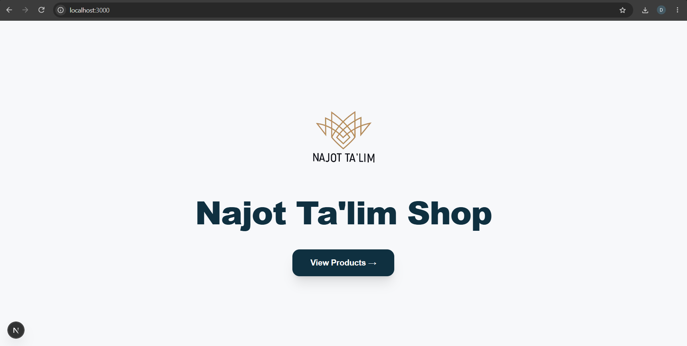
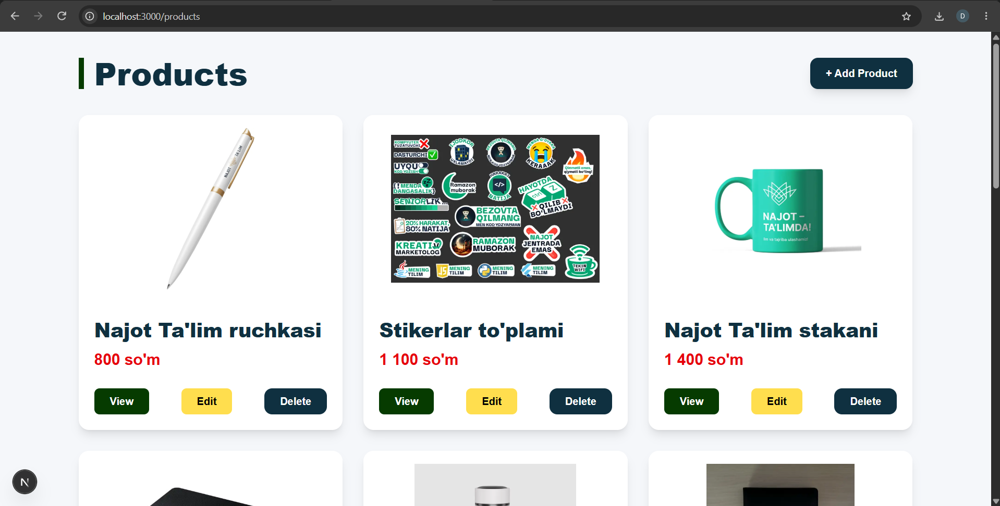
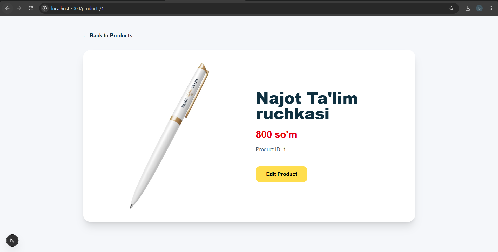
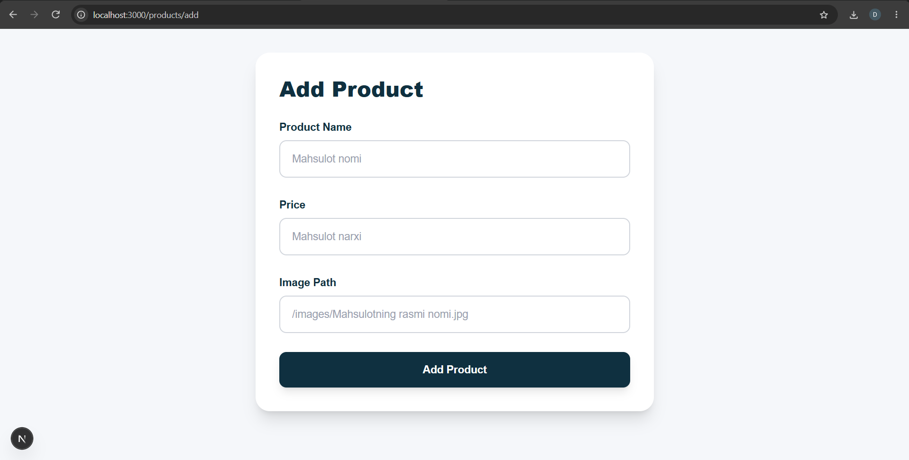
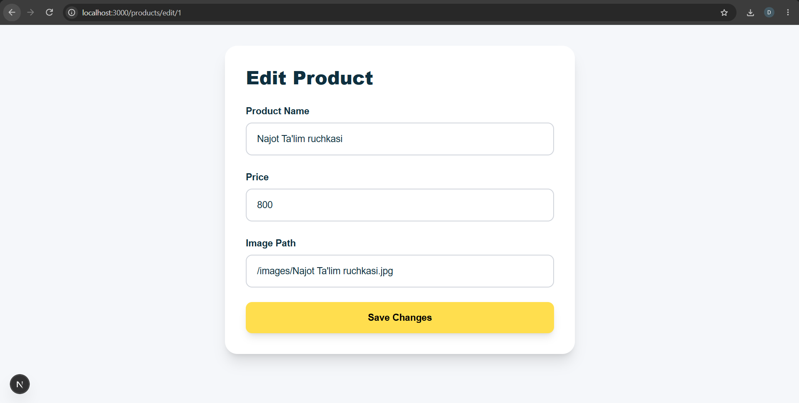

# Najot Ta'lim Shop

Next.js CRUD Products application built with Next.js, TypeScript, App Router and REST API. | Ushbu loyiha Next.js, TypeScript, App Router va REST API yordamida yaratilgan mahsulotlar CRUD ilovasi.

## Features | Imkoniyatlar

- Product CRUD Operations | Mahsulotlar uchun CRUD amallari
- Get All Products | Barcha mahsulotlarni olish
- Get Product by ID | Mahsulotni ID orqali olish
- Create Product | Yangi mahsulot yaratish
- Update Product | Mahsulotni tahrirlash
- Delete Product | Mahsulotni o'chirish
- Product Details Page | Mahsulot haqida batafsil ma'lumot sahifasi
- Dynamic Routes | Dinamik routelar
- REST API using Next.js Route Handlers | Next.js Route Handler yordamida REST API
- Responsive User Interface | Moslashuvchan foydalanuvchi interfeysi
- Product Images | Mahsulot rasmlarini ko'rsatish
- Form Handling | Formalar bilan ishlash
- Navigation using Next.js Link | Next.js Link yordamida sahifalar orasida o'tish
- Client-side Navigation | Client tomonida navigatsiya
- Loading State | Yuklanish holatini ko'rsatish

---

## Technologies Used | Ishlatilgan texnologiyalar

- Next.js
- React
- TypeScript
- Tailwind CSS
- Next.js App Router
- Next.js Route Handlers
- REST API
- Next.js Image
- Next.js Link
- React Hooks

---

## CRUD Operations | CRUD Amallari

| Operation | Method | Description | Tavsif |
|---|---|---|---|
| Create | POST | Create a new product | Yangi mahsulot yaratish |
| Read | GET | Get products | Mahsulotlarni olish |
| Update | PATCH | Update a product | Mahsulotni tahrirlash |
| Delete | DELETE | Delete a product | Mahsulotni o'chirish |

---

## Product Model | Mahsulot modeli

```text
Product
-------
id
title
price
image
```

### ID

Unique product identifier. | Mahsulotning takrorlanmas identifikatori.

### Title

Product name. | Mahsulot nomi.

### Price

Product price. | Mahsulot narxi.

### Image

Product image path. | Mahsulot rasmi joylashgan manzil.

---

## API Endpoints | API Endpointlari

### Products

| Method | Endpoint | Description | Tavsif |
|---|---|---|---|
| GET | `/api/products` | Get all products | Barcha mahsulotlarni olish |
| POST | `/api/products` | Create a product | Yangi mahsulot yaratish |
| GET | `/api/products/:id` | Get product by ID | Mahsulotni ID orqali olish |
| PATCH | `/api/products/:id` | Update product | Mahsulotni tahrirlash |
| DELETE | `/api/products/:id` | Delete product | Mahsulotni o'chirish |

---

## Pages | Sahifalar

### Home Page | Bosh sahifa

Main landing page of Najot Ta'lim Shop. | Najot Ta'lim Shop loyihasining asosiy sahifasi.

```text
/
```

### Products Page | Mahsulotlar sahifasi

Displays all available products. | Barcha mavjud mahsulotlarni ko'rsatadi.

```text
/products
```

### Product Details | Mahsulot haqida batafsil

Displays detailed information about a selected product. | Tanlangan mahsulot haqida batafsil ma'lumotni ko'rsatadi.

```text
/products/:id
```

### Add Product | Mahsulot qo'shish

Form for creating a new product. | Yangi mahsulot yaratish uchun forma.

```text
/products/add
```

### Edit Product | Mahsulotni tahrirlash

Form for updating an existing product. | Mavjud mahsulotni tahrirlash uchun forma.

```text
/products/edit/:id
```

---

## Product Data | Mahsulot ma'lumotlari

Each product contains the following information. | Har bir mahsulot quyidagi ma'lumotlarni o'z ichiga oladi.

### Product Name | Mahsulot nomi

Required product title. | Mahsulot nomi kiritiladi.

### Price | Narx

Product price in Uzbek so'm. | Mahsulot narxi O'zbekiston so'mida ko'rsatiladi.

### Image Path | Rasm manzili

Path to the product image inside the `public/images` directory. | `public/images` ichidagi mahsulot rasmining manzili.

Example | Misol:

```text
/images/Najot Ta'lim ruchkasi.jpg
```

---

## Installation | O'rnatish

Install project dependencies. | Loyiha kutubxonalarini o'rnating.

```bash
npm install
```

---

## Run Project | Loyihani ishga tushirish

Development Mode | Development rejimi:

```bash
npm run dev
```

Open the application in the browser. | Loyihani brauzerda oching.

```text
http://localhost:3000
```

---

## Build Project | Loyihani build qilish

Create a production build. | Production uchun build yaratish.

```bash
npm run build
```

Run the production build. | Production buildni ishga tushirish.

```bash
npm start
```

---

# Screenshots | Screenshotlar

## Home Page | Bosh sahifa

Najot Ta'lim Shop home page. | Najot Ta'lim Shop bosh sahifasi.



---

## Products Page | Mahsulotlar sahifasi

Displays the list of available products with View, Edit and Delete actions. | Mavjud mahsulotlarni View, Edit va Delete amallari bilan ko'rsatadi.



---

## Product Details | Mahsulot haqida batafsil

Displays detailed information about a selected product. | Tanlangan mahsulot haqida batafsil ma'lumotni ko'rsatadi.



---

## Add Product | Mahsulot qo'shish

Form for adding a new product. | Yangi mahsulot qo'shish uchun forma.



---

## Edit Product | Mahsulotni tahrirlash

Form for editing an existing product. | Mavjud mahsulotni tahrirlash uchun forma.



---

## Author | Muallif

**Davron Jurayev**